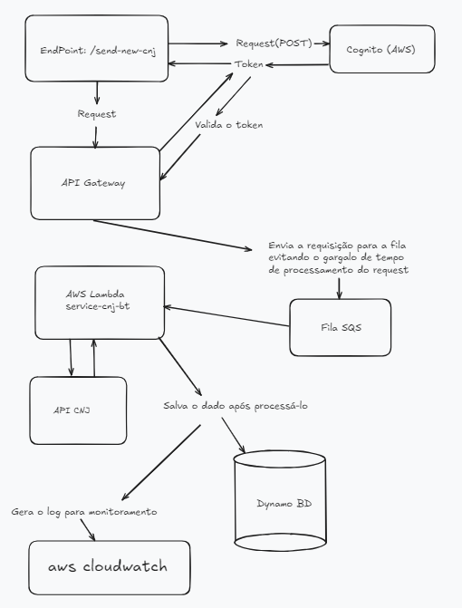

# API CNJ

Este projeto implementa um serviço serverless na AWS para processar números CNJ através de uma API. Utiliza Lambda, SQS e DynamoDB para o processamento e armazenamento dos dados.

Esse projeto consiste na criação de uma arquitetura serverless que irá receber números de processos do CNJ e processá-los utilizando uma AWS Lambda.

O fluxo segue a seguinte estrutura:
- **API Gateway + Cognito + SQS + Lambda + DynamoDB**

## Arquitetura do Projeto
O serviço utiliza os seguintes recursos:

- **API Gateway (`bt-api-cnj`)**: Responsável por receber requisições HTTP POST com dados de números CNJ.
- **SQS Queue (`CNJQueueBt`)**: Atua como um buffer, recebendo as requisições enviadas pelo API Gateway, garantindo a performance e gerenciamento de carga ao processar múltiplas requisições.
- **Lambda Function (`CNJprocess`)**: Função que consome as mensagens da fila SQS e processa os números CNJ, valida e armazena os dados no DynamoDB.
- **DynamoDB Table (`CNJTableBt`)**: Tabela que armazena os números CNJ processados, garantindo a disponibilidade dos dados.

## Recursos
### Lambda Function
- **Handler**: `index.handler`
- **Eventos**:
  - **SQS**: `CNJQueueBt`

### DynamoDB Table
- **Nome da Tabela**: `CNJTableBt`
- **Capacidade Provisionada**:
  - **Leitura**: 5 unidades
  - **Gravação**: 10 unidades

### SQS Queue
- **Nome da Fila**: `CNJQueueBt`

### API Gateway
- **Nome da API**: `bt-api-cnj`
- **Caminho**: `/send-new-cnj`
- **Método**: POST

## Configuração de ambiente
1. **Instale os pacotes necessários**: `npm install`.
2. **Configure suas credenciais AWS**: Configure seu ambiente e credencias corretamente.
3. **Faça o deploy do serviço**: Executando o commando `serverless deploy`.

## Uso e validação
1. **Enviando uma requisição do tipo POST para a API**:
   - URL: `https://{api-id}.execute-api.{region}.amazonaws.com/dev/send-new-cnj`
   - Corpo da requisição: JSON contendo o número CNJ.

2. **Verificando**:
   - Acesse a tabela `CNJTableBt` para verificar os registros armazenados.
   - Acesse o AWS Cloudwatch para validar os logs gerados